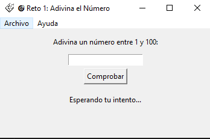
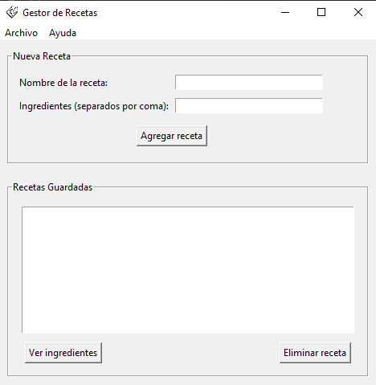

# Proyecto Juego

Este repositorio contiene dos aplicaciones interactivas desarrolladas en Python utilizando la biblioteca Tkinter. Estas aplicaciones fueron creadas como parte de un proyecto educativo para demostrar conceptos de programación orientada a objetos, interfaces gráficas y manejo de datos.

## Proyectos Incluidos


### 1. Juego de Adivinanza (Adivina_Tk.py)
Un juego clásico de adivinanza de números donde el usuario debe adivinar un número secreto generado aleatoriamente entre 1 y 100.

**Características principales:**
- Generación aleatoria de números secretos
- Pistas visuales (demasiado alto/bajo)
- Contador de intentos
- Opción de reiniciar el juego
- Menú de ayuda con instrucciones
- Información del creador

### 2. Gestor de Recetas (Recetas.py)
Una aplicación para gestionar recetas culinarias, permitiendo agregar, visualizar y eliminar recetas con sus respectivos ingredientes.

**Características principales:**
- Agregar nuevas recetas con nombre e ingredientes
- Visualización de ingredientes de recetas existentes
- Eliminación de recetas
- Interfaz intuitiva con lista de recetas
- Validación de entrada de datos
- Menú de ayuda con instrucciones

## Requisitos del Sistema

- **Python**: Versión 3.6 o superior
- **Tkinter**: Incluido por defecto en la instalación estándar de Python
- **Sistema Operativo**: Compatible con Windows, macOS y Linux

## Instalación

1. **Clona el repositorio:**
   ```bash
   git clone https://github.com/tu-usuario/proyecto-juego.git
   cd proyecto-juego
   ```

2. **Asegúrate de tener Python instalado:**
   Verifica la instalación ejecutando:
   ```bash
   python --version
   ```

3. **Ejecuta las aplicaciones:**
   - Para el juego de adivinanza:
     ```bash
     python Adivina_Tk.py
     ```
   - Para el gestor de recetas:
     ```bash
     python Recetas.py
     ```

## Uso

### Juego de Adivinanza
1. Al iniciar la aplicación, se genera automáticamente un número secreto entre 1 y 100.
2. Ingresa un número en el campo de texto y presiona "Comprobar".
3. Recibirás pistas indicando si el número es demasiado alto o bajo.
4. Continúa intentando hasta adivinar el número correcto.
5. Una vez ganado, puedes reiniciar el juego desde el menú Archivo.

### Gestor de Recetas
1. Ingresa el nombre de la receta en el campo correspondiente.
2. Escribe los ingredientes separados por comas.
3. Presiona "Agregar receta" para guardar la nueva receta.
4. Selecciona una receta de la lista para ver sus ingredientes.
5. Usa el botón "Eliminar receta" para remover recetas no deseadas.

## Capturas de Pantalla

### Juego de Adivinanza
- **Pantalla principal**: Muestra el campo de entrada, botón de comprobar y área de resultados.
- **Mensaje de victoria**: Diálogo que aparece al adivinar correctamente el número.
- **Menú de ayuda**: Instrucciones detalladas del juego.
  
<p align="center">
  
</p>


### Gestor de Recetas
- **Interfaz principal**: Formulario para agregar recetas y lista de recetas guardadas.
- **Vista de ingredientes**: Diálogo que muestra los ingredientes de una receta seleccionada.
- **Confirmación de eliminación**: Mensaje que confirma la eliminación exitosa de una receta.




## Autor

**Feibert Guzmán**
- Versión: 1.0
- Año: 2025
- Proyecto educativo de desarrollo de software

## Licencia

Este proyecto está bajo la Licencia MIT. Consulta el archivo LICENSE para más detalles.

## Contribución

Si deseas contribuir a este proyecto:

1. Haz un fork del repositorio
2. Crea una rama para tu feature (`git checkout -b feature/nueva-funcionalidad`)
3. Realiza tus cambios y haz commit (`git commit -am 'Agrega nueva funcionalidad'`)
4. Push a la rama (`git push origin feature/nueva-funcionalidad`)
5. Abre un Pull Request

## Soporte

Para preguntas o soporte, puedes contactar al autor del proyecto.

---

¡Disfruta explorando estas aplicaciones y experimentando con la programación en Python!


